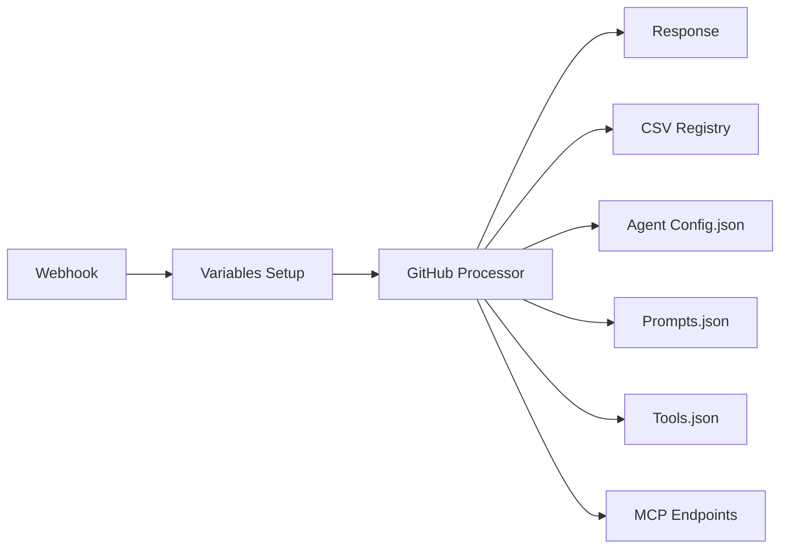

# 🚀 GITHUB-FIRST ARCHITECTURE - DOCUMENTAÇÃO TÉCNICA

## **RESUMO EXECUTIVO**

Migração da arquitetura N8N de **multi-nodes complexos** para **GitHub-First com 3 nodes apenas**, usando **SSV Variables** para comunicação e **CSV Registry** para configuração dinâmica de agents.

---

## **🎯 PREMISSAS ADOTADAS**

### **Premissa 1: Manutenção Externa ao N8N**
- ✅ **Toda lógica de negócio** no GitHub
- ✅ **Manutenção via git commits** (não N8N UI)
- ✅ **Hot deployment** automático
- ❌ **Zero lógica hardcoded** no N8N

### **Premissa 2: SSV Variables Pattern**
- ✅ **1 JSON consolidado** caminha entre todos nodes
- ✅ **Variables Setup** como Set Node padrão N8N
- ✅ **Comunicação via $json** entre nodes
- ✅ **Runtime context** preservado

### **Premissa 3: CSV Registry Dynamic Loading**
- ✅ **CSV como índice master** para agents
- ✅ **JSON configs** individuais no GitHub
- ✅ **Lookup dinâmico** por agent_id + project_id
- ✅ **MCP endpoints** configuráveis via CSV

### **Premissa 4: 3 Nodes Architecture**
- ✅ **Node 1**: Variables Setup (Set Node)
- ✅ **Node 2**: GitHub Processor Loader (Code Node)
- ✅ **Node 3**: Response (HTTP Response Node)
- ❌ **Máximo 3 nodes** para qualquer workflow

### **Premissa 5: Backward Compatibility**
- ✅ **Webhook endpoints** existentes funcionam
- ✅ **Agent IDs** preservados (agent_001, agent_002, agent_003)
- ✅ **Project IDs** preservados (project_001, project_002)
- ✅ **MCP endpoints** existentes funcionam

---

## **🏗️ ARQUITETURA DETALHADA**

### **Fluxo Geral:**


### **Data Flow:**
```
Input: {project_id, agent_id, query}
  ↓
Variables Setup: Consolidate SSV
  ↓
GitHub Processor: Load configs + Call AI
  ↓
Response: Return formatted result
```

---

## **📊 ESTRUTURA DE DADOS**

### **SSV Variables Structure (Node 1 Output):**
```javascript
{
  // === WORKFLOW CONFIG ===
  workflow_config: {
    version: "github-first-v2.0",
    github_base: $vars.UPTAX_GITHUB_BASE,
    registry_csv_url: "${github_base}/assembly-logic/agents-registry.csv",
    cache_enabled: true,
    cache_ttl_ms: 300000,
    processor_type: "universal_github"
  },

  // === REQUEST DATA ===
  request_data: {
    project_id: "project_001",        // From webhook
    agent_id: "agent_001",            // From webhook
    query: "user query text",         // From webhook
    session_id: "project_001_agent_001_1234567890",
    timestamp: "2025-01-26T10:00:00.000Z"
  },

  // === RUNTIME CONTEXT ===
  runtime: {
    workflow_id: "work-1001-github-first",
    n8n_execution_id: $executionId,
    processing_step: "variables_setup_completed",
    debug_mode: true
  }
}
```

### **CSV Registry Structure:**
```csv
agent_id,agent_name,specialization,config_url,prompts_url,processor_url,mcp_endpoint,mcp_type,webhook_endpoint,system_prompt,model_name,status
agent_001,enhanced_research,Brazilian market research,https://raw.githubusercontent.com/.../config.json,https://raw.githubusercontent.com/.../prompts.json,https://raw.githubusercontent.com/.../processor.js,https://mcp.brightdata.com/sse,bright_data,/research-agent,You are...,models/gemini-2.0-flash,active
```

### **GitHub Config Structure:**
```javascript
// config.json
{
  "agent_name": "enhanced-research-agent",
  "version": "2.0.0",
  "type": "langchain_agent",
  "description": "Enhanced AI research agent",
  "tools_config": {...}
}

// prompts.json
{
  "system_message": "You are an expert research assistant...",
  "instructions": [...],
  "tools_guidance": {...}
}

// tools.json
{
  "tools_config": {
    "langchain_tools": [...],
    "mcp_integrations": {...}
  }
}
```

---

## **⚙️ IMPLEMENTAÇÃO DETALHADA**

### **ETAPA 1: Variables Setup Node (Set Node)**
```javascript
// Node Name: SSV Variables Setup
// Node Type: Set Node

const webhookData = $input.item.json.body || {};

return [{
  json: {
    workflow_config: {
      version: "github-first-v2.0",
      github_base: $vars.UPTAX_GITHUB_BASE || "https://raw.githubusercontent.com/Uptax-creator/N8N-Research-Agents/clean-deployment",
      registry_csv_url: `${$vars.UPTAX_GITHUB_BASE}/assembly-logic/agents-registry.csv`,
      cache_enabled: true,
      cache_ttl_ms: parseInt($vars.UPTAX_CACHE_TTL_MS || '300000'),
      processor_type: "universal_github"
    },

    request_data: {
      project_id: webhookData.project_id || $vars.UPTAX_PROJECT_ID || "project_001",
      agent_id: webhookData.agent_id || "agent_001",
      query: webhookData.query || "Default query",
      session_id: `${webhookData.project_id || 'project_001'}_${webhookData.agent_id || 'agent_001'}_${Date.now()}`,
      timestamp: new Date().toISOString()
    },

    runtime: {
      workflow_id: "work-1001-github-first",
      n8n_execution_id: $executionId || 'local_test',
      processing_step: "variables_setup_completed",
      debug_mode: $vars.UPTAX_DEBUG_MODE === 'true'
    }
  }
}];
```

### **ETAPA 2: GitHub Processor Loader (Code Node)**
```javascript
// Node Name: GitHub Processor Loader
// Node Type: Code Node

const ssv = $('SSV Variables Setup').item.json;

console.log('🚀 GitHub Processor Loader - Universal v2.0');
console.log('📋 SSV Config:', ssv.workflow_config.version);

// === LOAD UNIVERSAL PROCESSOR FROM GITHUB ===
const processorUrl = `${ssv.workflow_config.github_base}/processors/universal-workflow-processor.js`;

try {
  console.log('📥 Loading processor:', processorUrl);
  const response = await fetch(processorUrl);

  if (!response.ok) {
    throw new Error(`HTTP ${response.status}: ${response.statusText}`);
  }

  const processorCode = await response.text();

  // === EXECUTE UNIVERSAL PROCESSOR WITH SSV ===
  const processor = new Function(
    'ssv', '$vars', 'getWorkflowStaticData', 'fetch', 'console',
    processorCode + '; return executeWorkflow(ssv, $vars, getWorkflowStaticData, fetch, console);'
  );

  const result = await processor(ssv, $vars, getWorkflowStaticData, fetch, console);

  console.log('✅ GitHub processor executed successfully');
  return [{ json: result }];

} catch (error) {
  console.error('❌ GitHub processor failed:', error.message);

  // === FALLBACK RESPONSE ===
  return [{
    json: {
      success: false,
      error: 'GitHub processor unavailable',
      fallback_response: `Processed query: ${ssv.request_data.query}`,
      ssv_preserved: ssv,
      error_details: error.message
    }
  }];
}
```

### **ETAPA 3: Response Node (HTTP Response)**
- **Node Type**: HTTP Response (Respond to Webhook)
- **Response Code**: 200
- **Response Body**: `{{ $json }}`

---

## **📁 ESTRUTURA GITHUB REQUERIDA**

### **Repositório: N8N-Research-Agents**
```
/assembly-logic/
  ├── agents-registry.csv              # Master registry
  └── agents-registry-graph.csv        # Graph-specific registry

/processors/
  └── universal-workflow-processor.js  # Main processor logic

/N8N/agents/enhanced-research-agent/
  ├── config.json                      # Agent configuration
  ├── prompts.json                     # System messages
  └── tools.json                       # MCP tools config

/N8N/projects/project_001/
  ├── agent_001_tools.json             # Project-specific tools
  ├── agent_002_tools.json
  └── agent_003_tools.json
```

### **Universal Processor Requirements:**
```javascript
// /processors/universal-workflow-processor.js

async function executeWorkflow(ssv, vars, getWorkflowStaticData, fetch, console) {
  // 1. Parse SSV and validate inputs
  // 2. Load agent config from CSV registry
  // 3. Load config.json, prompts.json, tools.json
  // 4. Initialize MCP endpoints
  // 5. Call AI Agent with tools
  // 6. Format response with metadata
  // 7. Return structured result
}
```

---

## **🔄 MIGRATION ROADMAP**

### **Phase 1: Infrastructure Setup**
1. ✅ **Create SSV Variables Setup** (Set Node)
2. ✅ **Create GitHub Processor Loader** (Code Node)
3. ✅ **Configure Response** (HTTP Response Node)
4. ⏳ **Test basic SSV flow** (without AI Agent)

### **Phase 2: GitHub Processor Development**
1. ⏳ **Create universal-workflow-processor.js**
2. ⏳ **Implement CSV registry loading**
3. ⏳ **Implement config/prompts/tools loading**
4. ⏳ **Test GitHub processor isolation**

### **Phase 3: AI Agent Integration**
1. ⏳ **Integrate AI Agent calls**
2. ⏳ **Implement MCP endpoint routing**
3. ⏳ **Test end-to-end with real agents**
4. ⏳ **Performance optimization**

### **Phase 4: Production Deployment**
1. ⏳ **Replace existing workflows**
2. ⏳ **Monitor performance**
3. ⏳ **Documentation update**
4. ⏳ **Team training**

---

## **📊 VALIDAÇÃO E TESTES**

### **Test Commands:**
```bash
# Test webhook endpoint
curl -X POST "https://primary-production-56785.up.railway.app/webhook/work-1001v1" \
-H "Content-Type: application/json" \
-d '{
  "project_id": "project_001",
  "agent_id": "agent_001",
  "query": "teste github-first architecture"
}'

# Test GitHub configs accessibility
curl -s "https://raw.githubusercontent.com/Uptax-creator/N8N-Research-Agents/clean-deployment/assembly-logic/agents-registry.csv"

# Test processor loading
curl -s "https://raw.githubusercontent.com/Uptax-creator/N8N-Research-Agents/clean-deployment/processors/universal-workflow-processor.js"
```

### **Expected Results:**
- ✅ **SSV Variables** flow correctly between nodes
- ✅ **GitHub configs** load dynamically
- ✅ **Agent selection** works via CSV lookup
- ✅ **MCP endpoints** route correctly
- ✅ **Response format** matches expectations

---

## **🔍 MONITORAMENTO E DEBUG**

### **Debug Points:**
1. **Variables Setup**: Log SSV structure
2. **GitHub Processor**: Log config loading
3. **CSV Registry**: Log agent lookup
4. **AI Agent**: Log MCP calls
5. **Response**: Log final output

### **Performance Metrics:**
- **Response Time**: < 10 seconds end-to-end
- **Cache Hit Rate**: > 80% for repeated calls
- **Error Rate**: < 1% for valid requests
- **GitHub Loading**: < 2 seconds per config

---

## **💡 BENEFÍCIOS ESPERADOS**

### **Desenvolvimento:**
- **⚡ Hot deployment**: Git push = código atualizado
- **🔄 Version control**: Todas mudanças versionadas
- **🧪 Testing**: Processors testáveis isoladamente
- **📝 Documentation**: Código auto-documentado

### **Operação:**
- **🎯 Simplicidade**: 3 nodes vs 7+ nodes
- **🛡️ Robustez**: Menos pontos de falha
- **📈 Escalabilidade**: Novos agents via CSV
- **🔧 Manutenção**: Zero touching N8N UI

### **Negócio:**
- **⚡ Time-to-market**: Novos agents em minutos
- **💰 Custo reduzido**: Menos complexidade
- **🎛️ Flexibilidade**: Configs dinâmicos
- **📊 Observabilidade**: Logs centralizados

---

## **⚠️ RISCOS E MITIGAÇÕES**

### **Risco 1: GitHub Indisponibilidade**
- **Mitigação**: Cache local + fallback configs
- **SLA**: 99.9% uptime GitHub

### **Risco 2: Performance Degradation**
- **Mitigação**: Cache agressivo + CDN
- **Target**: < 10s response time

### **Risco 3: Breaking Changes**
- **Mitigação**: Versioning + backward compatibility
- **Process**: Staged rollouts

---

**📋 DOCUMENTO DE ARQUITETURA GITHUB-FIRST v2.0**
**Data**: 2025-01-26
**Status**: ✅ Aprovado para implementação
**Próximo**: Implementar universal-workflow-processor.js