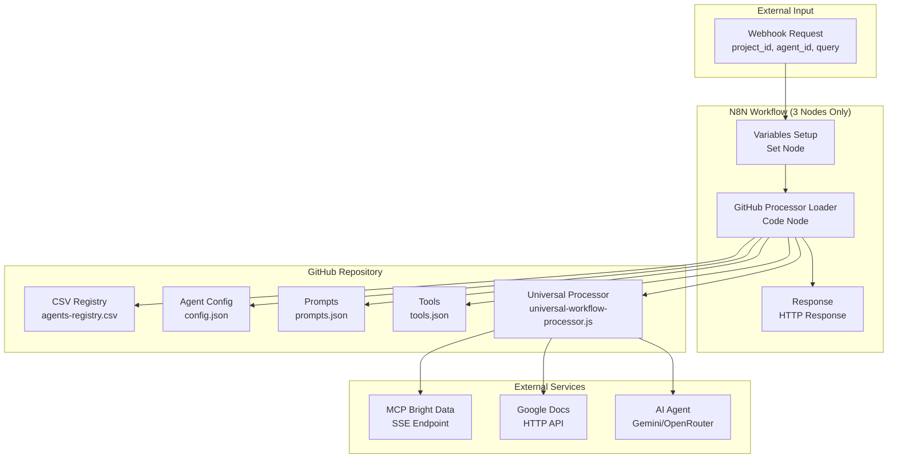
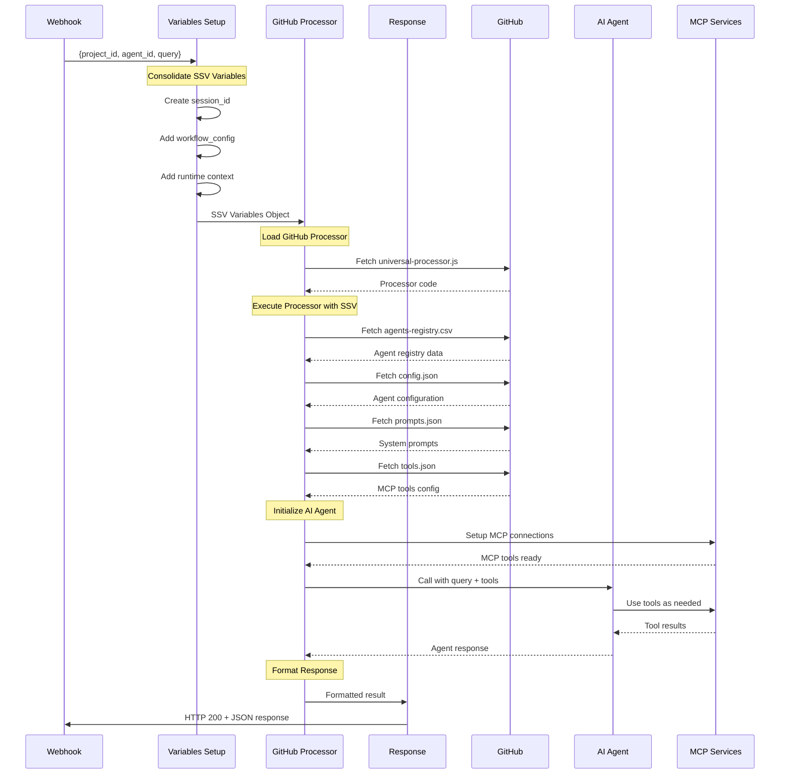
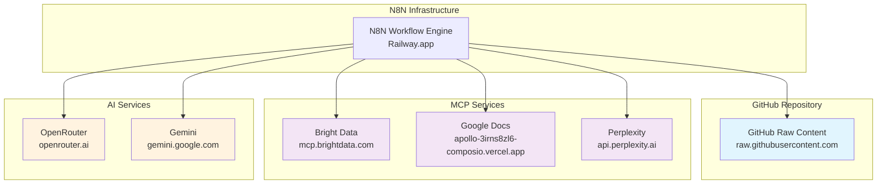
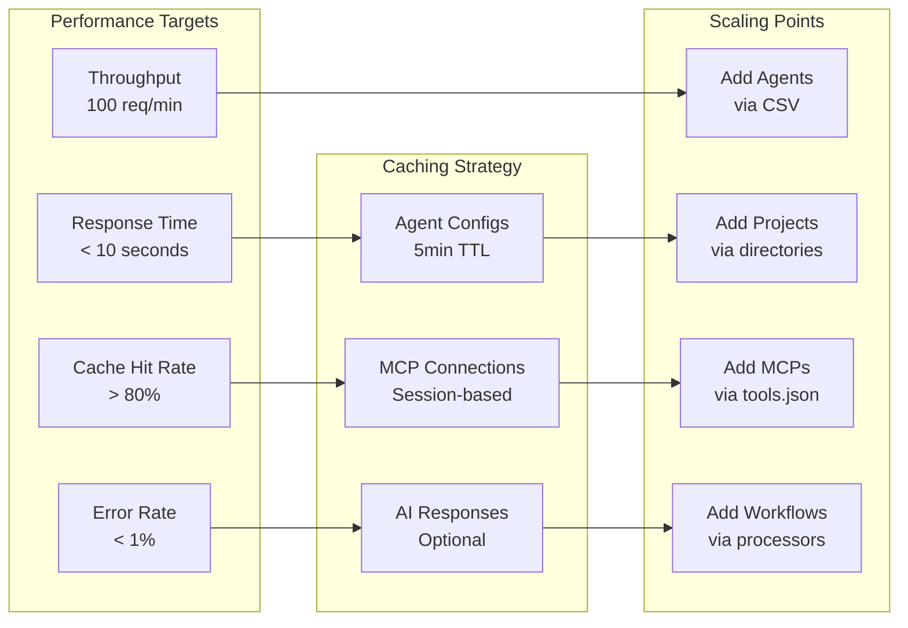
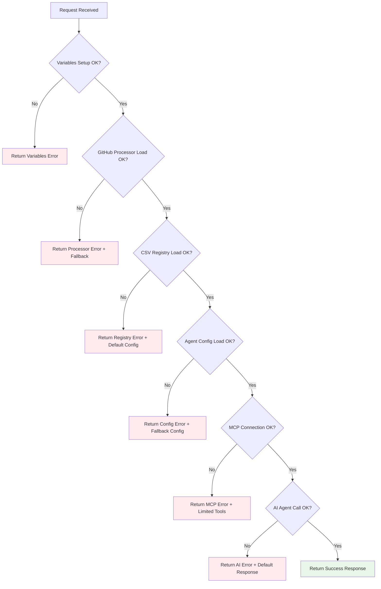
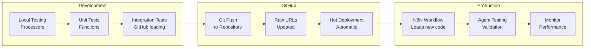

# 📊 GITHUB-FIRST ARCHITECTURE - DIAGRAMAS

## **🎯 VISÃO GERAL DO SISTEMA**



## **🔄 FLUXO DE DADOS DETALHADO**



## **📁 ESTRUTURA DE ARQUIVO GITHUB**

```
N8N-Research-Agents/
├── assembly-logic/
│   ├── agents-registry.csv              # 🎯 Master Agent Registry
│   └── agents-registry-graph.csv        # Graph-specific configs
│
├── processors/
│   ├── universal-workflow-processor.js  # 🚀 Main Processor Logic
│   ├── ai-agent-handler.js              # AI Agent integration
│   └── response-formatter.js            # Response formatting
│
├── N8N/agents/
│   ├── enhanced-research-agent/
│   │   ├── config.json                  # Agent configuration
│   │   ├── prompts.json                 # System messages
│   │   └── tools.json                   # MCP tools
│   ├── fiscal-research-agent/
│   │   ├── config.json
│   │   ├── prompts.json
│   │   └── tools.json
│   └── gdocs-documentation-agent/
│       ├── config.json
│       ├── prompts.json
│       └── tools.json
│
└── N8N/projects/
    ├── project_001/
    │   ├── agent_001_tools.json         # Project-specific tools
    │   ├── agent_002_tools.json
    │   └── agent_003_tools.json
    └── project_002/
        ├── agent_001_tools.json
        └── agent_002_tools.json
```

## **⚙️ DATA TRANSFORMATION FLOW**

```mermaid
graph LR
    subgraph "Input Processing"
        A1[Webhook Input<br/>{project_id, agent_id, query}]
        A2[Variables Setup<br/>Add session_id, config, runtime]
        A3[SSV Object<br/>Complete workflow variables]
    end

    subgraph "Configuration Loading"
        B1[CSV Registry Lookup<br/>agent_id → agent_row]
        B2[Load config.json<br/>Agent configuration]
        B3[Load prompts.json<br/>System messages]
        B4[Load tools.json<br/>MCP endpoints]
    end

    subgraph "AI Processing"
        C1[Initialize MCP<br/>Connect to endpoints]
        C2[Call AI Agent<br/>With tools + prompts]
        C3[Process Response<br/>Format output]
    end

    subgraph "Output Generation"
        D1[Add Metadata<br/>Processing info]
        D2[Final Response<br/>Structured JSON]
        D3[HTTP Response<br/>Return to client]
    end

    A1 --> A2 --> A3
    A3 --> B1 --> B2 --> B3 --> B4
    B4 --> C1 --> C2 --> C3
    C3 --> D1 --> D2 --> D3
```

## **🔧 NODE CONFIGURATION MATRIX**

| Node | Type | Inputs | Processing | Outputs |
|------|------|--------|------------|---------|
| **Variables Setup** | Set Node | `$input.item.json.body` | Consolidate SSV | `ssv_variables` |
| **GitHub Processor** | Code Node | `$('Variables Setup').item.json` | Load & Execute GitHub processor | `processed_result` |
| **Response** | HTTP Response | `$json` | Return HTTP response | Client response |

## **🌐 EXTERNAL DEPENDENCIES MAP**



## **📊 PERFORMANCE & SCALING**



## **🚨 ERROR HANDLING FLOW**



## **🔄 DEPLOYMENT PIPELINE**



---

**📋 DIAGRAMAS GITHUB-FIRST ARCHITECTURE v2.0**
**Status**: ✅ Ready for Implementation
**Next**: Create universal-workflow-processor.js