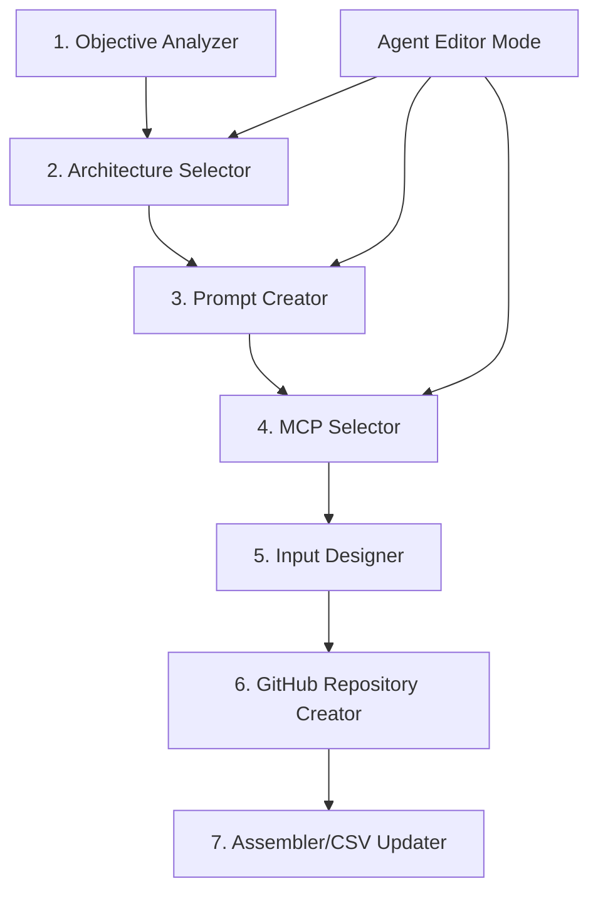

# 🚀 AGENT CREATION PIPELINE - PROCESSO COMPLETO

## 📋 **Documento de Referência Definitivo**
**Data:** 01/10/2025
**Versão:** 1.0.0
**Status:** DOCUMENTO OFICIAL
**GitHub:** https://github.com/Uptax-creator/N8N-Research-Agents/clean-deployment

---

## 🎯 **OBJETIVO**

Criar um pipeline automatizado para criação e edição de agents N8N usando meta single agent e meta multi agent architecture.

---

## 🏗️ **ARQUITETURA PIPELINE**

### **Pipeline Sequence (Ordem Otimizada):**



---

## 📝 **COMPONENTES DETALHADOS**

### **1. Objective Analyzer**
**Entrada:** Texto livre do usuário
**Função:** Analisar objetivo e gerar requirements estruturados
**Saída:** JSON com requirements

```json
{
  "domain": "research|documentation|automation|analysis",
  "complexity": "simple|medium|complex",
  "data_sources": ["web", "docs", "apis", "files"],
  "output_format": "report|document|dashboard|api",
  "language": "pt-br|en|multi",
  "industry": "fiscal|tech|marketing|finance",
  "tools_needed": ["web_scraping", "document_creation"]
}
```

### **2. Architecture Selector**
**Entrada:** Requirements JSON
**Função:** Escolher template de arquitetura
**Saída:** Template selecionado

```yaml
Available_Templates:
  work_1001: "Research + MCP + GitHub formatter"
  work_1002: "Simple Q&A + single MCP"
  work_1003: "Complex workflow + multiple MCPs"
  work_1004: "Document generation + Google Docs"
  work_1005: "Multi-agent pipeline"
```

### **3. Prompt Creator**
**Entrada:** Requirements + Template
**Função:** Criar prompt JSON otimizado
**Saída:** Prompt JSON estruturado

```json
{
  "system_prompts": {
    "base_system": "Prompt principal do sistema",
    "tool_selection": "Como selecionar ferramentas",
    "research_methodology": "Metodologia de pesquisa",
    "output_formatting": "Como formatar saída"
  },
  "task_prompts": {
    "market_research": "Prompt específico para pesquisa de mercado",
    "fiscal_analysis": "Prompt para análise fiscal",
    "technical_documentation": "Prompt para documentação técnica"
  },
  "examples": [
    {
      "input": "Exemplo de entrada",
      "output": "Exemplo de saída esperada"
    }
  ]
}
```

### **4. MCP Selector**
**Entrada:** Requirements
**Função:** Selecionar MCPs homologados
**Saída:** Lista de MCPs

```yaml
Homologated_MCPs:
  bright_data_sse:
    capabilities: ["web_scraping", "search_engine"]
    endpoint: "https://mcp.brightdata.com/sse?token=..."
    priority: 1
  google_docs_mcp:
    capabilities: ["document_creation", "collaboration"]
    endpoint: "https://apollo-3irns8zl6-composio.vercel.app/..."
    priority: 2
  github_mcp:
    capabilities: ["code_management", "version_control"]
    endpoint: "https://api.github.com/mcp"
    priority: 3
```

### **5. Input Designer**
**Entrada:** Requirements
**Função:** Definir webhook e entrada
**Saída:** Configuração de entrada

```json
{
  "webhook": {
    "path": "/agent-001-research",
    "method": "POST",
    "validation": {
      "required": ["query"],
      "optional": ["format", "depth", "language"]
    }
  },
  "input_schema": {
    "query": "string",
    "format": "comprehensive|summary|bullet_points",
    "depth": "basic|standard|comprehensive",
    "language": "pt-br|en"
  }
}
```

### **6. GitHub Repository Creator**
**Entrada:** Configurações compiladas
**Função:** Criar estrutura no GitHub
**Saída:** URLs dos arquivos criados

```bash
# Estrutura criada:
agents/
├── agent_XXX/
│   ├── config.json
│   ├── prompts.json
│   ├── formatter.js
│   └── tools.json
```

### **7. Assembler/CSV Updater**
**Entrada:** Todos os outputs anteriores
**Função:** Gerar configuração final e atualizar registry
**Saída:** Agent configurado e registry atualizado

---

## 📊 **CSV STRUCTURE (ENHANCED)**

```csv
workflow_id,project_id,agent_id,agent_type,description,prompt_url,processor_url,response_formatter_url,mcp_endpoint,tools_config_url,status,version,created_by,updated_at
```

**Campos essenciais:**
- `response_formatter_url`: Campo que estava faltando
- `mcp_endpoint`: Suporte a múltiplos MCPs via JSON
- `tools_config_url`: Configuração de ferramentas específicas

---

## 🧪 **PROCESSO DE TESTE**

### **Meta Single Agent Testing:**

1. **Usar CSV Enhanced Existente**
   - `assembly-logic/agents-registry-enhanced.csv`
   - 3 agents pré-configurados
   - 2 MCPs diferentes

2. **Criar Novos Prompts JSON para Teste**
   ```bash
   # Prompts específicos que executem as tools:
   - agent_001: Bright Data web scraping
   - agent_002: Bright Data fiscal research
   - agent_003: Google Docs creation
   ```

3. **Validar Meta Multi Agent**
   - Pipeline de agents sequenciais
   - Handoff entre agents
   - Aggregação de resultados

---

## 📁 **ORGANIZAÇÃO DE DOCUMENTOS**

### **Estrutura de Pastas:**

```bash
N8N/
├── docs/
│   ├── AGENT_CREATION_PIPELINE_PROCESS.md (ESTE DOCUMENTO)
│   ├── PARECER_CONJUNTO_ESPECIALISTAS.md
│   ├── PLANO_RESPONSE_FORMATTER_GITHUB.md
│   └── ARQUITETURA_OTIMIZADA_GITHUB_FIRST.md
├── assembly-logic/
│   ├── agents-registry-enhanced.csv (USAR ESTE)
│   └── agents-registry-graph-v2.csv (REFERÊNCIA)
├── workflows/
│   ├── work_1001_PC_FIXED.json (FUNCIONANDO)
│   └── work_1001_PROTOCOL_COMPLETE.json (REFERÊNCIA)
├── prompts/
│   ├── agents/
│   │   ├── agent_001_enhanced_research.json (CRIAR)
│   │   ├── agent_002_fiscal_research.json (CRIAR)
│   │   └── agent_003_gdocs_documentation.json (CRIAR)
└── formatters/
    ├── enhanced-research-formatter.js (EXISTE)
    ├── fiscal-research-formatter.js (CRIAR)
    └── gdocs-formatter.js (CRIAR)
```

---

## 🎯 **PRÓXIMAS AÇÕES**

### **AÇÃO 1: Organizar Documentos** ⚡
```bash
# Mover documentos para pasta docs/
# Publicar no GitHub
# Criar README principal
```

### **AÇÃO 2: Criar Prompts JSON de Teste** ⚡
```json
# agent_001_enhanced_research.json
{
  "system_prompts": {
    "base_system": "Você é um especialista em pesquisa de mercado brasileiro. Use SEMPRE a ferramenta search_engine para buscar informações atualizadas.",
    "tool_usage": "OBRIGATÓRIO: Use search_engine() para toda pesquisa. Use scrape_as_markdown() para analisar sites específicos."
  },
  "task_prompts": {
    "market_research": "Execute search_engine(query='{query}') e analise resultados detalhadamente"
  }
}
```

### **AÇÃO 3: Testar Meta Single Agent** ⚡
```bash
# Usar work_1001_PC_FIXED.json
# Testar com 3 agents diferentes
# Validar MCPs funcionam
# Confirmar response formatters
```

### **AÇÃO 4: Implementar Pipeline** ⚡
```python
# Criar cada componente no Claude Code
# Testar pipeline completo
# Migrar para N8N
```

---

## 🚨 **LIÇÕES APRENDIDAS**

### **Problemas Anteriores:**
1. ❌ **Prompts não executavam tools** - Faltava instrução específica
2. ❌ **CSV structure inconsistente** - Campo response_formatter_url faltando
3. ❌ **Documentos espalhados** - Difícil de encontrar referências
4. ❌ **Versões múltiplas** - Confusão sobre qual usar

### **Soluções Implementadas:**
1. ✅ **Prompts explícitos para tool usage**
2. ✅ **CSV structure padronizada**
3. ✅ **Documentação centralizada**
4. ✅ **Versão única de referência**

---

## 📈 **ROADMAP**

### **Semana 1: Foundation**
- [x] Documentação do processo
- [ ] Organizar estrutura de arquivos
- [ ] Criar prompts JSON de teste
- [ ] Validar meta single agent

### **Semana 2: Pipeline Implementation**
- [ ] Implementar componentes no Claude Code
- [ ] Testar pipeline completo
- [ ] Migrar para N8N
- [ ] Validar meta multi agent

### **Semana 3: Production**
- [ ] Deploy pipeline em produção
- [ ] Criar interface web
- [ ] Documentação de usuário
- [ ] Treinamento da equipe

---

## 🔗 **REFERÊNCIAS**

- **CSV Enhanced:** `assembly-logic/agents-registry-enhanced.csv`
- **Workflow Funcionando:** `workflows/work_1001_PC_FIXED.json`
- **Parecer Especialistas:** Score 81/100 - VALIDADO
- **GitHub Repository:** https://github.com/Uptax-creator/N8N-Research-Agents

---

**🎯 OBJETIVO FINAL:** Pipeline 100% automatizado para criação de agents N8N com meta single/multi agent architecture escalável.