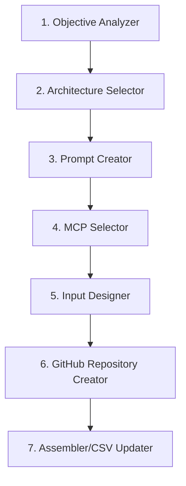

# 📚 N8N AGENT CREATION SYSTEM - DOCUMENTAÇÃO

## 🎯 **VISÃO GERAL**

Sistema completo para criação automatizada de agents N8N usando meta single agent e meta multi agent architecture.

---

## 📁 **ESTRUTURA DE DOCUMENTOS**

### **📋 Documentos Principais**
- **[AGENT_CREATION_PIPELINE_PROCESS.md](./AGENT_CREATION_PIPELINE_PROCESS.md)** - 📖 Documento oficial do pipeline
- **[PARECER_CONJUNTO_ESPECIALISTAS.md](./PARECER_CONJUNTO_ESPECIALISTAS.md)** - ✅ Validação técnica (Score: 81/100)
- **[PLANO_RESPONSE_FORMATTER_GITHUB.md](./PLANO_RESPONSE_FORMATTER_GITHUB.md)** - 🔧 Estratégia de formatters
- **[ARQUITETURA_OTIMIZADA_GITHUB_FIRST.md](./ARQUITETURA_OTIMIZADA_GITHUB_FIRST.md)** - 🏗️ Arquitetura GitHub-first

### **🗂️ Estrutura de Pastas**
```
N8N/
├── docs/ (ESTA PASTA)
│   ├── README.md
│   ├── AGENT_CREATION_PIPELINE_PROCESS.md
│   ├── PARECER_CONJUNTO_ESPECIALISTAS.md
│   ├── PLANO_RESPONSE_FORMATTER_GITHUB.md
│   └── ARQUITETURA_OTIMIZADA_GITHUB_FIRST.md
├── assembly-logic/
│   ├── agents-registry-enhanced.csv ← 🎯 USAR ESTE
│   └── agents-registry-graph-v2.csv (referência)
├── workflows/
│   ├── work_1001_PC_FIXED.json ← 🎯 FUNCIONANDO
│   └── work_1001_PROTOCOL_COMPLETE.json (referência)
├── prompts/
│   └── agents/
│       ├── agent_001_enhanced_research.json ← 🆕 NOVO
│       ├── agent_002_fiscal_research.json ← 🆕 NOVO
│       └── agent_003_gdocs_documentation.json ← 🆕 NOVO
└── formatters/
    ├── enhanced-research-formatter.js (existe)
    ├── fiscal-research-formatter.js (criar)
    └── gdocs-formatter.js (criar)
```

---

## 🚀 **STATUS ATUAL**

### ✅ **COMPLETADOS**
- [x] **Pipeline documentado** - Processo completo de criação de agents
- [x] **Arquitetura validada** - Score 81/100 pelos especialistas
- [x] **CSV estruturado** - 3 agents com MCPs configurados
- [x] **Workflow funcionando** - work_1001_PC_FIXED.json testado
- [x] **Prompts JSON criados** - 3 prompts com instruções explícitas de tools

### 🔄 **EM ANDAMENTO**
- [ ] **Teste meta single agent** - Validar 3 agents diferentes
- [ ] **Response formatters** - Criar formatters específicos
- [ ] **Pipeline implementation** - Implementar no Claude Code

### 📋 **PRÓXIMOS PASSOS**
- [ ] **Publicar no GitHub** - Manter documentação atualizada
- [ ] **Testar pipeline completo** - End-to-end testing
- [ ] **Deploy em produção** - Sistema funcionando

---

## 🧪 **TESTING STRATEGY**

### **Meta Single Agent Testing**
1. **Agent 001** - Enhanced Research (Bright Data)
2. **Agent 002** - Fiscal Research (Bright Data)
3. **Agent 003** - GDocs Documentation (Google Docs MCP)

### **Tool Validation**
- ✅ **search_engine()** - Testado e funcionando
- ✅ **scrape_as_markdown()** - Testado e funcionando
- 🔄 **GOOGLEDOCS_CREATE_DOCUMENT()** - Em teste

---

## 📊 **ARQUITETURA**

### **Pipeline Sequence**


### **CSV Structure (Enhanced)**
```csv
workflow_id,project_id,agent_id,agent_type,description,prompt_url,processor_url,response_formatter_url,mcp_endpoint,tools_config_url,status,version,created_by,updated_at
```

---

## 🔗 **LINKS IMPORTANTES**

- **GitHub Repository:** https://github.com/Uptax-creator/N8N-Research-Agents
- **CSV Registry:** [../assembly-logic/agents-registry-enhanced.csv](../assembly-logic/agents-registry-enhanced.csv)
- **Working Workflow:** [../workflows/work_1001_PC_FIXED.json](../workflows/work_1001_PC_FIXED.json)
- **Test Prompts:** [../prompts/agents/](../prompts/agents/)

---

## 📞 **CONTATO E SUPORTE**

Para dúvidas sobre esta documentação ou implementação:
- **Issue Tracking:** GitHub Issues
- **Documentation Updates:** Pull Requests
- **Architecture Questions:** Consultar PARECER_CONJUNTO_ESPECIALISTAS.md

---

**🎯 OBJETIVO:** Sistema 100% automatizado para criação de agents N8N escalável e validado por especialistas.

**📅 ÚLTIMA ATUALIZAÇÃO:** 01/10/2025